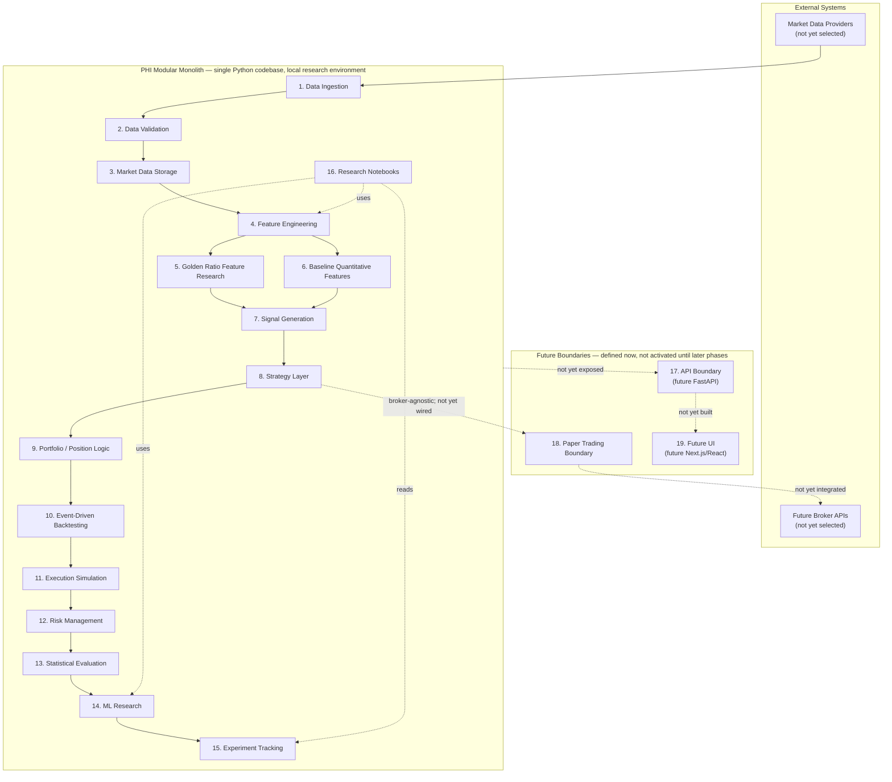

# PHI System Architecture

## 1. Document Control

- **Status:** Draft — Pending Review
- **Version:** 0.1.0
- **Last Updated:** 2026-08-07
- **Owner:** TBD (Suggested: Engineering Lead)
- **Scope:** System-level architecture for Project PHI. Defines module boundaries, data flow, event model, time semantics, research/falsification methodology, and the evolutionary path from local research tooling to a paper-trading-capable platform. Component-level detail is deferred to the documents listed in [§35 Related Documents](#35-related-documents) and is out of scope here.

## 2. Executive Summary

Project PHI is a research-first quantitative intelligence platform. Its immediate purpose is not to trade — it is to determine, with methodological rigor, whether Golden Ratio / Fibonacci-derived mathematical features carry statistically defensible predictive information in financial markets, when tested against strong baselines and placebo controls. Everything else (backtesting, portfolio logic, paper trading, APIs, UI) exists to support that research process and to give it a credible path toward eventual live use, *if and only if* the research supports it.

This document defines PHI as a **modular monolith**: a single deployable Python codebase with strict internal module boundaries and an in-process event-driven core for the quantitative/backtesting path. No distributed infrastructure, no microservices, and no streaming platforms are introduced at this stage — they are explicitly deferred until real scale or latency requirements justify their cost (see [§29 Architecture Decision Summary](#29-architecture-decision-summary) and [§26 Deployment Evolution](#26-deployment-evolution)).

The architecture treats scientific falsifiability as a first-class, non-negotiable requirement: the system must be equally capable of showing that Golden Ratio features work, that they don't, or that results are inconclusive, and it must make it structurally difficult to fool itself via look-ahead bias, leakage, or overfitting.

## 3. Architectural Goals

- Support a rigorous, falsifiable research loop from hypothesis to statistically evaluated conclusion.
- Make temporal information leakage (look-ahead bias, feature leakage) structurally difficult, not just procedurally discouraged.
- Keep the system reproducible: a given result should be re-derivable from versioned code, data, and configuration.
- Preserve clean logical module boundaries from day one so the system can evolve (e.g., backtest → paper trading → live; monolith → selective service extraction) without a core rewrite.
- Avoid infrastructure that is not justified by current data volume, team size, or latency requirements.
- Keep every architectural claim honest: no invented benchmarks, no guaranteed outcomes, no premature performance thresholds.

## 4. Non-Goals

This architecture explicitly does **not** attempt to:

- Achieve high-frequency-trading-grade latency or co-located execution.
- Support multi-tenant, multi-user, or SaaS-style concurrent usage.
- Provide distributed, horizontally-scaled data processing (no Kafka, Spark, Flink, or Kubernetes at this stage).
- Provide a dedicated feature store or online/offline feature-serving infrastructure.
- Implement live broker trading (Phase 4 concern, not current scope).
- Prove that Golden Ratio / Fibonacci-derived features have predictive power. That is a research *question*, not an assumption this architecture is built to satisfy.
- Define final database schemas, API endpoints, or broker integrations — these belong to the component-level documents referenced in [§35](#35-related-documents), once those are drafted.

## 5. Architectural Principles

1. **Falsifiability first.** Every research feature, including Golden Ratio features, must be evaluable against controls capable of showing it has no effect.
2. **Time-ordering integrity.** No component may access information that would not have been available at the simulated decision time. This is enforced architecturally, not just by convention (see [§12](#12-time-semantics)).
3. **Reproducibility over convenience.** Prefer deterministic, versioned, re-runnable processes over ad hoc scripts, even when slower to build initially.
4. **Boundaries before distribution.** Establish clean module contracts now so that splitting a module into a separate service later (if ever justified) is a boundary extraction, not a rewrite.
5. **Evolutionary architecture.** Defer infrastructure investment until a concrete, observed requirement (data volume, latency, concurrency) justifies it. See the "Future Trigger" column in [§29](#29-architecture-decision-summary).
6. **Baseline-relative evaluation.** No research result is interpreted in isolation; every candidate feature or model is evaluated against baselines and placebo controls under identical conditions.
7. **Explicit uncertainty.** Where a decision is not yet made (data provider, universe source, deployment target), it is recorded as open ([§32](#32-open-architecture-questions)) rather than resolved by assumption.

## 6. System Context

PHI operates as a single research system with the following external and adjacent relationships:

- **Market data providers (external, not yet selected):** the sole source of ground-truth price/volume/reference data. PHI treats providers as untrusted external inputs subject to validation (module 2) — see [§32](#32-open-architecture-questions) for the open question on final provider selection.
- **Local research environment:** in Phase 1–2, PHI runs on a single researcher's machine (optionally inside Docker for environment consistency), not on shared or cloud infrastructure. This is a deliberate scope constraint, not a limitation to be immediately engineered around.
- **Researchers / users:** in Phase 1–2, the primary "user" is the researcher operating notebooks and scripts directly against the modular monolith's Python API. There is no separate UI or multi-user access model yet.
- **Future brokers:** paper-trading and (eventually, conditionally) live brokers are external systems PHI will integrate with only after the research and validation phases justify moving forward. No broker is selected yet.
- **Future external services:** experiment tracking (MLflow), data versioning (DVC), and object storage are anticipated future dependencies (Phase 2+) but are not required for the system to function today.

PHI does not currently expose any network-facing interface. All external interaction in Phase 1 is data ingestion (inbound, pull-based) and researcher-driven code execution (local).

## 7. Architecture Overview

The diagram below shows the Phase 1–2 modular monolith: all sixteen core modules run in a single process/codebase with in-process event flow. The API, paper-trading, and UI boundaries exist as defined interfaces in the codebase but are not activated until later phases (see [§26](#26-deployment-evolution)).



Solid arrows represent the active Phase 1–2 data/event flow. Dashed arrows represent defined-but-inactive boundaries reserved for later phases. No component on the right (`FUTURE`) is implemented at this stage; the boundary exists in the module layout so that activating it later does not require restructuring `CORE`.

## 8. Architectural Style

PHI combines three styles, applied deliberately to different parts of the system rather than uniformly:

**Modular monolith (overall system).** All sixteen core modules ship as one deployable unit with enforced internal boundaries (clear module interfaces, no reaching across module internals). This is chosen because: the team is small (effectively a single researcher-operator at this stage), requirements are still being discovered through research rather than fixed, and the cost of premature service boundaries (network calls, serialization, deployment orchestration, distributed debugging) would slow down the actual research work without a corresponding benefit. A monolith with real internal boundaries is not a shortcut — it is the correct architecture for this stage, and the boundaries are what make future extraction possible.

**Event-driven core (backtesting/quantitative path).** Modules 7–13 (Signal Generation through Statistical Evaluation) communicate via a conceptual event sequence (see [§11](#11-event-model)), not direct function-call coupling. This is the same pattern used by established open-source backtesting engines (event-driven backtesters process market data as discrete events rather than operating on a pre-joined table of "future-known" results), and it is chosen specifically because it is the standard defense against look-ahead bias: a component can only react to an event once that event has "occurred" in simulated time, and the same event flow can in principle drive both backtest and paper-trading execution without rewriting the strategy logic. In Phase 1–2 this event flow is in-process (Python objects/callbacks), not a message bus — there is no Kafka or equivalent, because there is no concurrent multi-process consumer that would justify one.

**Request-driven interfaces (future boundaries only).** Where PHI eventually exposes functionality to something outside the research process itself — an API (module 17) or a UI (module 19) — that boundary is request/response (HTTP), because those interactions are inherently synchronous asks ("give me this backtest result") rather than a stream of market events. This style is not active yet; it is scoped for Phase 3+.

**Why microservices are deferred, explicitly:** microservices solve problems PHI does not yet have — independent scaling of components, independent team ownership, independent deployment cadence, or fault isolation across untrusted boundaries. Introducing them now would add network latency, distributed transaction complexity, and operational overhead (service discovery, inter-service auth, distributed tracing) to a system whose actual bottleneck is research methodology, not infrastructure scale. The modular monolith's internal boundaries are designed so that *if* a module later needs independent scaling (e.g., feature engineering becomes a shared service across multiple research processes), it can be extracted along its existing interface rather than requiring a redesign.

## 9. Major System Modules

Each module below is a logical boundary within the single PHI codebase, not a separate deployable unit (except where future evolution is noted).

### 9.1 Data Ingestion

- **Purpose:** Acquire raw market data (and any other external research data) from external providers.
- **Responsibilities:** Fetch historical and (eventually) real-time data from configured providers; normalize provider-specific formats into a common raw schema; record provenance (source, fetch timestamp, provider identifiers).
- **Inputs:** External market data provider APIs/files (provider TBD, [§32](#32-open-architecture-questions)).
- **Outputs:** Raw, provider-tagged records passed to Data Validation.
- **Dependencies:** None internal; depends on external provider availability.
- **Boundaries:** Does not validate, clean, or interpret data — it only acquires and tags it. Does not decide what is "correct."
- **Future evolution:** Additional providers can be added as new ingestion adapters without changing downstream modules, provided they conform to the raw schema contract.

### 9.2 Data Validation

- **Purpose:** Reject or flag data that is malformed, inconsistent, or suspicious before it enters storage.
- **Responsibilities:** Schema validation, range/sanity checks, gap and duplicate detection, timestamp monotonicity checks, provider-disagreement flags (when multiple sources exist).
- **Inputs:** Raw records from Data Ingestion.
- **Outputs:** Validated records (with validation metadata attached) to Market Data Storage; rejected/flagged records routed to a quarantine path for manual review.
- **Dependencies:** Data Ingestion.
- **Boundaries:** Does not silently "fix" data (e.g., does not interpolate missing bars without explicit, logged, reversible policy) — validation failures must be visible, not hidden, per [§18](#18-bias-prevention-architecture).
- **Future evolution:** Validation rules can grow in strictness as the survivorship-bias-free universe source and provider are finalized.

### 9.3 Market Data Storage

- **Purpose:** Persist validated market data durably and queryably for both backtesting and research use.
- **Responsibilities:** Store time-series price/volume/reference data; support efficient range queries by symbol/time; preserve full history (no destructive overwrites of prior data).
- **Inputs:** Validated records from Data Validation.
- **Outputs:** Queryable historical data for Feature Engineering and the Backtesting market clock/historical data handler.
- **Dependencies:** Data Validation.
- **Boundaries:** Storage engine choice (PostgreSQL/TimescaleDB/Parquet/DuckDB roles) is defined conceptually in [§22](#22-storage-architecture); exact schemas belong to [DATABASE_ARCHITECTURE.md](DATABASE_ARCHITECTURE.md) (currently a skeleton).
- **Future evolution:** Storage can scale from local files/single-instance database toward managed/cloud storage without changing the query interface other modules depend on, if volume ever requires it.

### 9.4 Feature Engineering

- **Purpose:** Transform stored market data into model-ready features, shared infrastructure used by both the Golden Ratio research family and baseline features.
- **Responsibilities:** Provide common transformation utilities (rolling windows, normalization, resampling); enforce that every feature computation respects the T-1/information-barrier rule ([§12](#12-time-semantics)); version feature definitions.
- **Inputs:** Market Data Storage.
- **Outputs:** Feature vectors/series consumed by Golden Ratio Feature Research, Baseline Quantitative Features, and ML Research.
- **Dependencies:** Market Data Storage.
- **Boundaries:** Does not decide which features are "good" — that is Statistical Evaluation's role. Feature Engineering only guarantees correct, leakage-free computation.
- **Future evolution:** Could later be extracted into a shared feature-computation service if multiple concurrent research processes need it — not justified today (see [§29](#29-architecture-decision-summary), "no dedicated feature store").

### 9.5 Golden Ratio Feature Research

- **Purpose:** Generate the specific research family of φ/Fibonacci-derived features under test. See [§14](#14-golden-ratio-research-architecture) for full treatment.
- **Responsibilities:** Deterministic, versioned generation of φ-based feature candidates; no claim of predictive value is made or assumed by this module.
- **Inputs:** Feature Engineering primitives, Market Data Storage.
- **Outputs:** φ-feature candidates to Signal Generation and Statistical Evaluation, on equal footing with Baseline Quantitative Features.
- **Dependencies:** Feature Engineering.
- **Boundaries:** This module is a *feature producer*, not a decision-maker. It must not bypass the Falsification/Placebo Architecture ([§15](#15-falsification--placebo-architecture)).
- **Future evolution:** New φ-feature categories can be added as separate versioned generators; none replace the requirement to compare against baselines.

### 9.6 Baseline Quantitative Features

- **Purpose:** Provide conventional, well-understood quantitative/technical features and simple statistical baselines to compare against Golden Ratio features and ML models on equal footing.
- **Responsibilities:** Implement standard technical indicators and simple statistical baselines (e.g., moving averages, momentum, volatility measures, naive persistence forecasts) using the same Feature Engineering primitives as module 5.
- **Inputs:** Feature Engineering primitives, Market Data Storage.
- **Outputs:** Baseline feature/prediction candidates to Signal Generation and Statistical Evaluation.
- **Dependencies:** Feature Engineering.
- **Boundaries:** Must use identical computation infrastructure (same windowing, same leakage guards) as module 5 so comparisons are fair.
- **Future evolution:** Baseline set can expand as new "obvious" comparisons are identified during research.

### 9.7 Signal Generation

- **Purpose:** Convert features (Golden Ratio, baseline, or model-derived) into trade signals usable by the Strategy Layer.
- **Responsibilities:** Apply a strategy's signal logic to available features at decision time; emit `SignalEvent`s ([§11](#11-event-model)).
- **Inputs:** Golden Ratio Feature Research, Baseline Quantitative Features, ML Research outputs.
- **Outputs:** `SignalEvent`s to the Strategy Layer.
- **Dependencies:** Feature-producing modules (5, 6, 14).
- **Boundaries:** Does not size positions or manage risk — it only expresses a directional/quantitative view.
- **Future evolution:** Signal logic can be swapped (rule-based → model-based) without changing downstream Strategy/Portfolio modules.

### 9.8 Strategy Layer

- **Purpose:** Encode the decision logic that turns signals into intended trading actions, independent of whether execution is a backtest, paper trade, or (eventually) live trade.
- **Responsibilities:** Interpret `SignalEvent`s in the context of current portfolio state; produce intended orders; remain broker-agnostic (see [§24](#24-paper-trading-boundary)).
- **Inputs:** `SignalEvent`s from Signal Generation; current state from Portfolio/Position Logic.
- **Outputs:** Order intents to Portfolio/Position Logic and, downstream, `OrderEvent`s into the backtest/execution path.
- **Dependencies:** Signal Generation, Portfolio/Position Logic.
- **Boundaries:** Must not directly touch execution mechanics (fills, slippage) — that is Execution Simulation's responsibility. This separation is what allows the same Strategy code to run unchanged across backtest, paper, and future live execution.
- **Future evolution:** Multiple strategies can coexist behind this boundary; execution target (backtest/paper/live) is swapped without touching strategy code.

### 9.9 Portfolio / Position Logic

- **Purpose:** Track intended and actual positions, cash, and portfolio state over time.
- **Responsibilities:** Maintain position/cash accounting; translate strategy intents into sized orders subject to available capital and (later) risk constraints; consume `FillEvent`s to update state.
- **Inputs:** Order intents from Strategy Layer; `FillEvent`s from Execution Simulation.
- **Outputs:** `PositionEvent`/`PortfolioEvent`s; sized `OrderEvent`s to Event-Driven Backtesting/Execution Simulation.
- **Dependencies:** Strategy Layer, Execution Simulation (via events), Risk Management (constraints).
- **Boundaries:** Does not decide trading logic (that's Strategy) and does not simulate fills (that's Execution Simulation) — it is pure state and accounting.
- **Future evolution:** Same module serves backtest, paper trading, and live trading; only the source of `FillEvent`s changes.

### 9.10 Event-Driven Backtesting

- **Purpose:** Orchestrate the historical simulation: replay market data as ordered events and drive Strategy → Portfolio → Execution Simulation → Risk → Evaluation in correct temporal sequence. See [§16](#16-backtesting-architecture) for full treatment.
- **Responsibilities:** Own the market clock; ensure strict event ordering; prevent any module from accessing data "ahead" of the clock.
- **Inputs:** Market Data Storage (historical), all downstream module outputs (for sequencing).
- **Outputs:** A complete, ordered event history and final portfolio/performance state to Statistical Evaluation.
- **Dependencies:** Market Data Storage, Strategy Layer, Portfolio/Position Logic, Execution Simulation, Risk Management.
- **Boundaries:** Is the *only* module allowed to advance simulated time. No other module may look up data by wall-clock time independent of the backtester's clock.
- **Future evolution:** The same event-sequencing contract is intended to also drive paper trading (module 18), replacing the historical data handler with a live/delayed data feed and the simulated execution handler with a paper-broker adapter — without changing Strategy or Portfolio code.

### 9.11 Execution Simulation

- **Purpose:** Model how intended orders become fills, including realistic frictions.
- **Responsibilities:** Simulate order fills against historical data with configurable assumptions for slippage, commissions, and (where applicable) market impact; emit `FillEvent`s; explicitly reject impossible fills (see [§16](#16-backtesting-architecture)).
- **Inputs:** `OrderEvent`s from Portfolio/Position Logic (via the backtester's event sequence).
- **Outputs:** `FillEvent`s.
- **Dependencies:** Event-Driven Backtesting (for timing), Market Data Storage (for fill-eligible prices).
- **Boundaries:** Must only use price data available strictly after the order's decision time — never the same-bar close used to generate the signal, unless explicitly modeled as a documented, realistic execution assumption.
- **Future evolution:** In Phase 3, this module's interface is implemented by a paper-broker adapter instead of a simulator, and in Phase 4 by a live-broker adapter — the `OrderEvent`/`FillEvent` contract does not change.

### 9.12 Risk Management

- **Purpose:** Apply conceptual risk constraints to the portfolio during backtesting and (later) paper/live trading. See [§20](#20-risk-architecture).
- **Responsibilities:** Monitor exposure, leverage, concentration, and drawdown against configured (not hardcoded) limits; emit `RiskEvent`s when constraints are breached or approached.
- **Inputs:** `PositionEvent`/`PortfolioEvent`s.
- **Outputs:** `RiskEvent`s to Portfolio/Position Logic (which may reject/resize orders) and to Statistical Evaluation (for reporting).
- **Dependencies:** Portfolio/Position Logic.
- **Boundaries:** Defines conceptual risk responsibilities only at this stage; broker-specific risk mechanics (margin rules, PDT rules, etc.) are explicitly out of scope until Phase 3+.
- **Future evolution:** Constraint set grows richer (regime-conditioned limits, volatility targeting) as research findings warrant.

### 9.13 Statistical Evaluation

- **Purpose:** Turn raw backtest/experiment output into statistically interpretable evidence.
- **Responsibilities:** Compute performance and risk-adjusted metrics; run out-of-sample, walk-forward, permutation, and placebo comparisons ([§17](#17-validation-architecture)); apply multiple-testing-aware corrections where appropriate; produce evidence, not verdicts.
- **Inputs:** Completed backtest/experiment results from Event-Driven Backtesting and ML Research; baseline/placebo results for comparison.
- **Outputs:** Evaluation reports consumed by researchers (via Research Notebooks) and logged via Experiment Tracking.
- **Dependencies:** Event-Driven Backtesting, ML Research, Experiment Tracking.
- **Boundaries:** Does not declare a feature "proven" — see [§17](#17-validation-architecture) on avoiding hard thresholds. Presents evidence with appropriate uncertainty.
- **Future evolution:** Statistical methodology (e.g., which multiple-testing correction, which validation scheme) can be extended as the research program matures.

### 9.14 ML Research

- **Purpose:** House model training, validation, and inference for any learned (as opposed to rule-based) signal generation. See [§19](#19-ml-architecture).
- **Responsibilities:** Train baseline and candidate models on feature sets from modules 5/6; produce predictions for Signal Generation; record model metadata for reproducibility.
- **Inputs:** Golden Ratio Feature Research, Baseline Quantitative Features, Market Data Storage (labels).
- **Outputs:** Model predictions to Signal Generation; model artifacts and metadata to Experiment Tracking.
- **Dependencies:** Feature Engineering, Golden Ratio Feature Research, Baseline Quantitative Features.
- **Boundaries:** Does not implement production model-serving infrastructure at this stage — training and inference both happen within the research process (see [§19](#19-ml-architecture)).
- **Future evolution:** If a model is eventually promoted toward paper/live trading, an explicit versioned artifact and inference path is defined at that time — not built speculatively now.

### 9.15 Experiment Tracking

- **Purpose:** Record what was run, with what code/data/config, and what resulted — the backbone of reproducibility.
- **Responsibilities:** Log experiment configuration, code version (git commit), data version/hash, and results in a structured, queryable way.
- **Inputs:** Runs from Event-Driven Backtesting, ML Research, Statistical Evaluation.
- **Outputs:** A queryable experiment history for Research Notebooks and future MLflow integration.
- **Dependencies:** All modules that produce experiment results.
- **Boundaries:** In Phase 1–2, this is lightweight (structured local logs/config+result files, git-commit tagging) — not a hosted MLflow server (see [§21](#21-reproducibility-architecture)).
- **Future evolution:** Migrates to MLflow (or equivalent) once experiment volume and collaboration needs justify a dedicated tracking server.

### 9.16 Research Notebooks

- **Purpose:** The researcher-facing interface for exploration, visualization, and ad hoc analysis in Phase 1–2.
- **Responsibilities:** Provide interactive access to Feature Engineering, ML Research, and Experiment Tracking outputs; support exploratory work that has not yet been formalized into a tracked experiment.
- **Inputs:** All core modules, read-only where possible.
- **Outputs:** Human-consumed analysis; validated findings are promoted into tracked experiments (module 15) and, eventually, into `docs/18-decisions/` or `docs/04-research/`.
- **Dependencies:** Feature Engineering, ML Research, Experiment Tracking, Statistical Evaluation.
- **Boundaries:** Notebooks are for exploration, not the system of record — anything that needs to be reproducible must flow through Experiment Tracking, not live only in a notebook.
- **Future evolution:** Notebook-driven workflows may eventually be partially replaced or supplemented by the future UI (module 19) for non-technical result review.

### 9.17 API Boundary (future use)

- **Purpose:** Define, in advance, the seam at which PHI's internal quantitative engine would be exposed to external consumers (a future UI, external tooling).
- **Responsibilities (future):** Expose read access to experiment/backtest results and, later, controlled write access (e.g., triggering a paper-trading run).
- **Inputs/Outputs:** Not implemented. See [§23](#23-api-boundary).
- **Dependencies:** Statistical Evaluation, Experiment Tracking (for what it would expose).
- **Boundaries:** Not built in Phase 1–2. Existing only as a reserved seam in the module layout.
- **Future evolution:** Likely implemented with FastAPI when a real consumer (UI or external integration) exists — see [§23](#23-api-boundary).

### 9.18 Paper Trading Boundary (future use)

- **Purpose:** Define, in advance, the seam at which the Strategy/Portfolio/Event model would connect to a real (simulated-money) broker feed instead of the historical backtester.
- **Responsibilities (future):** Provide a broker-adapter implementation of the Execution Simulation interface backed by a real paper-trading account.
- **Inputs/Outputs:** Not implemented. See [§24](#24-paper-trading-boundary).
- **Dependencies:** Strategy Layer, Portfolio/Position Logic, Execution Simulation (interface).
- **Boundaries:** Not activated until the research program produces a strategy candidate worth testing under live-market conditions with simulated capital.
- **Future evolution:** Phase 3 concern; see [§26](#26-deployment-evolution).

### 9.19 Future UI Boundary (future use)

- **Purpose:** Define, in advance, the seam at which a future Next.js/React frontend would consume the API Boundary.
- **Responsibilities (future):** Present backtest/research results and, later, paper-trading status to a human user visually.
- **Inputs/Outputs:** Not implemented. See [§25](#25-frontend-boundary).
- **Dependencies:** API Boundary.
- **Boundaries:** Not built in Phase 1–2.
- **Future evolution:** Phase 3+ concern, contingent on the API Boundary existing first.

## 10. Data Flow

**Primary research/backtest flow:**

```
Market Data Providers
  → [1. Data Ingestion]
  → [2. Data Validation]
  → [3. Market Data Storage]
  → [4. Feature Engineering]
      → [5. Golden Ratio Feature Research]  ─┐
      → [6. Baseline Quantitative Features] ─┼→ [7. Signal Generation]
      → [14. ML Research]                   ─┘        (optionally via ML predictions)
  → [8. Strategy Layer]
  → [9. Portfolio / Position Logic]
  → [10. Event-Driven Backtesting]  (owns the clock; sequences the below)
      → [11. Execution Simulation]
      → [12. Risk Management]
  → [13. Statistical Evaluation]
  → [15. Experiment Tracking]
  → [16. Research Notebooks]  (human review; findings may loop back to 5/6/14)
```

**Research/ML flow (methodological, cross-cutting):** see [§13](#13-quantitative-research-architecture) for the hypothesis → feature → baseline → experiment → validation → backtest → statistical analysis → conclusion loop. This is not a separate pipeline so much as a discipline imposed on how modules 4–16 are used together for any given research question.

Every arrow in the primary flow above is subject to the time-ordering rule in [§12](#12-time-semantics): a module may only consume data that would have been available at the corresponding simulated time.

## 11. Event Model

PHI's backtesting/execution path is organized around a small set of conceptual events. These are defined here as *responsibilities and relationships* — no implementation (classes, schemas, message formats) is specified in this document.

- **MarketEvent** — Represents the arrival of new market data at a point in simulated time. Emitted by the market clock/historical data handler inside Event-Driven Backtesting. Triggers feature recomputation and signal evaluation for that time step. This is the event that advances simulated time; nothing else does.
- **SignalEvent** — Represents a directional/quantitative view produced by Signal Generation from currently available features. Consumed by the Strategy Layer. Does not imply a sized order yet.
- **OrderEvent** — Represents an intended trade produced by the Strategy Layer / Portfolio Logic in response to a `SignalEvent` and current portfolio state. Consumed by Execution Simulation (or, later, a paper/live broker adapter).
- **FillEvent** — Represents the (simulated or real) outcome of attempting to execute an `OrderEvent`, including realized price, quantity, commission, and slippage. Emitted by Execution Simulation. Consumed by Portfolio/Position Logic to update state.
- **PositionEvent** — Represents a change in a specific position's size or state, derived from `FillEvent`s. Emitted by Portfolio/Position Logic.
- **PortfolioEvent** — Represents a snapshot or change in overall portfolio state (aggregate positions, cash, equity). Emitted by Portfolio/Position Logic. Consumed by Risk Management and Statistical Evaluation.
- **RiskEvent** — Represents a risk constraint being approached or breached (exposure, leverage, drawdown, concentration). Emitted by Risk Management in response to `PortfolioEvent`s. May feed back into Portfolio/Position Logic to constrain further order sizing.
- **EvaluationEvent** — Represents the completion of a backtest/experiment run and the availability of results for statistical evaluation. Emitted by Event-Driven Backtesting on run completion. Consumed by Statistical Evaluation and Experiment Tracking.

**Relationships:** `MarketEvent` is the root cause of the chain `SignalEvent → OrderEvent → FillEvent → PositionEvent/PortfolioEvent → (optionally) RiskEvent`. `EvaluationEvent` terminates a run and hands off to the statistical layer. This chain is intentionally the same shape regardless of whether the source is historical replay (backtest), a delayed/live feed (paper trading), or a live feed with real execution (future live trading) — only the producers of `MarketEvent` and the consumer of `OrderEvent`/producer of `FillEvent` change across those contexts (see [§24](#24-paper-trading-boundary)).

## 12. Time Semantics

This section is the architectural backbone of PHI's defense against look-ahead bias and is binding on every module that touches data.

- **Event time** — The timestamp a piece of market data is *about* (e.g., the close time of a daily bar, the timestamp of a trade tick). This is a property of the data itself.
- **Availability time** — The timestamp at which that data was actually knowable to a real market participant. For most vendor data this is at or after event time (e.g., a daily bar's data is not fully knowable until the bar closes; some data — restated financials, corrected prints — may have an availability time significantly *after* event time). PHI must track availability time separately from event time wherever the two can diverge, and must default to the conservative (later) timestamp when uncertain.
- **Decision time** — The simulated "now" at which the Strategy Layer evaluates a signal and decides on an action. A decision may only use data whose availability time is ≤ decision time.
- **Execution time** — The simulated time at which an `OrderEvent` is assumed to be filled. Execution time must be strictly after decision time by a realistic (non-zero, non-favorable) interval — see the "no impossible fills" prohibition in [§16](#16-backtesting-architecture).
- **Observation window** — The historical span of data a feature or model is allowed to look backward over, ending no later than decision time.
- **Prediction horizon** — The forward-looking span a signal or model is making a claim about, starting no earlier than execution time.

**The T-1 / information barrier concept:** PHI enforces, as an architectural rule rather than a coding convention, that at simulated decision time *T*, no module may read data whose availability time is *T* or later using same-bar information as if it were already known. In practice this means: a decision made "at the close of bar T" may use information available *up to and including* bar T only if that information's availability time genuinely precedes or coincides with the decision point in a way a real participant could have acted on (e.g., using T's close to decide, then executing at T+1's open — not executing at T's close using T's close). Where ambiguity exists between same-bar close-to-close backtesting conventions and strict availability-time enforcement, the architecture defaults to the conservative interpretation (a one-step, "T-1," barrier between the last observed data point and the next tradable execution point) unless a specific, documented exception is justified for a specific dataset. This barrier is owned by Event-Driven Backtesting (module 10), which is the only module permitted to advance simulated time and therefore the only module positioned to enforce it consistently across all consumers.

## 13. Quantitative Research Architecture

PHI structures every research question as a loop, not a one-shot analysis:

```
Hypothesis
  → Feature (candidate, e.g., a φ-based ratio, or a baseline)
  → Baseline (what would a naive/conventional approach show?)
  → Experiment (defined dataset, window, model, evaluation method — logged via Experiment Tracking)
  → Validation (out-of-sample, walk-forward, placebo/permutation — see §17)
  → Backtest (event-driven, realistic frictions — see §16)
  → Statistical Analysis (evidence-based, correction-aware — see §13, §17)
  → Conclusion (support / weaken / falsify / inconclusive — feeds back into new hypotheses)
```

Every step is logged (module 15) so that a conclusion can be traced back to the exact code, data, and configuration that produced it. No step is allowed to skip ahead — in particular, "Conclusion" never occurs without both "Baseline" and "Validation" having been executed for the same experiment, which is what makes conclusions falsifiable rather than assumed.

## 14. Golden Ratio Research Architecture

Golden Ratio / Fibonacci-derived features are defined here as a **research family** — a set of candidate feature generators — not a validated or assumed signal. Nothing in this document, or in the codebase this document governs, should be read as a claim that these features are predictive. That determination is the *output* of the research loop in [§13](#13-quantitative-research-architecture) and [§17](#17-validation-architecture), not an input to it.

Illustrative (non-exhaustive, non-final) feature categories under this research family:

- **Fibonacci retracement relationships** — price relationships to historical swing high/low retracement levels.
- **Fibonacci extension relationships** — projected price relationships beyond a prior move, based on standard Fibonacci ratios.
- **φ-based price ratios** — ratios between price levels or price changes compared against φ (≈1.618) and related constants.
- **φ-based time relationships** — temporal spacing between market events (highs, lows, reversals) compared against φ-derived intervals.
- **Normalized φ distances** — how far an observed ratio deviates from an exact φ-derived value, normalized for comparability across instruments/regimes.
- **Regime-conditioned φ features** — the above, conditioned on a market regime label (e.g., trend vs. range), to test whether any effect is regime-dependent rather than universal.

**Reproducibility requirement:** every φ-feature generator must be deterministic given its inputs and version — same data, same parameters, same code version, same output. Feature definitions are versioned (module 4/5) so that a result can always be traced to the exact generator version that produced it. This is what allows the falsification architecture in [§15](#15-falsification--placebo-architecture) to make a fair, reproducible comparison.

## 15. Falsification / Placebo Architecture

> **Reconciliation (see [ADR 0002](../18-decisions/0002-phase2-feature-and-control-design-lock.md)).** The canonical control taxonomy is PRD [§18](../02-project/PHI_PRD.md#18-control--placebo-framework)'s six categories (PRD-CONTROL-001…006). The **"Non-φ mathematical ratios"** control listed below is **not** a separate category — it is a required instantiation of PRD-CONTROL-003 (fixed numerical benchmark), instantiation "C2" in the [feature & control contract](../05-mathematics/phi-retracement-feature-contract.md). The list below is the architectural intent; the contract is the frozen, implementation-grade source.

This is a mandatory, non-optional part of PHI's architecture: no Golden Ratio feature or model result is evaluated in isolation. Every evaluation compares φ-derived features against a control set, computed and evaluated under **identical conditions**:

- **Randomized scalar features** — features with the same statistical shape (distribution, autocorrelation profile) as the φ-feature but generated from randomization rather than φ-derived logic, to test whether any observed effect exceeds chance.
- **Benchmark ratios** — well-known, non-φ price/time ratios (e.g., round-number levels, arbitrary fixed percentages) used as a "does *any* ratio-based feature show this effect" control.
- **Non-φ mathematical ratios** — ratios derived from other mathematical constants or simple rational fractions, to isolate whether φ specifically matters versus "ratio-based features in general."
- **Conventional technical features** — the Baseline Quantitative Features (module 6), to answer "does this add anything beyond what a standard technical indicator already captures?"
- **Simple statistical baselines** — naive forecasts (e.g., persistence, unconditional mean) to establish the floor any feature must clear to be interesting at all.

**Controlled comparison requirement:** all competing features/models in a given experiment must use the same dataset, training window, test window, model class and hyperparameter search budget, evaluation methodology, and transaction-cost assumptions. Differences in results must be attributable to the feature itself, not to an uncontrolled difference in experimental setup. This requirement is enforced by Statistical Evaluation (module 13) reading experiment configuration from Experiment Tracking (module 15) and rejecting/flagging comparisons whose configurations differ in any dimension other than the feature under test.

## 16. Backtesting Architecture

PHI's backtester follows the established event-driven pattern used by production-grade open-source backtesting/trading engines: market data is replayed as discrete, ordered events rather than operated on as a pre-joined "God table" that implicitly contains future information.

**Components:**

- **Market clock** — Advances simulated time strictly forward, one event at a time. Owned by Event-Driven Backtesting (module 10). No other component may query "current time" independently.
- **Historical data handler** — Feeds `MarketEvent`s to the system in correct time order, sourced from Market Data Storage. In paper/live trading this component is replaced by a live/delayed feed adapter without changing anything downstream (see [§24](#24-paper-trading-boundary)).
- **Strategy** — Module 8, reacting to `SignalEvent`s/`MarketEvent`s to produce order intents.
- **Portfolio** — Module 9, tracking state and sizing orders.
- **Order generation** — The Portfolio/Strategy pairing emitting `OrderEvent`s.
- **Execution simulator** — Module 11, converting `OrderEvent`s into `FillEvent`s using only data available strictly after decision time.
- **Slippage** — An explicit, configurable assumption about the difference between expected and realized fill price. Must never default to zero/favorable slippage silently.
- **Commissions** — An explicit, configurable per-trade or per-share cost assumption, applied to every simulated fill.
- **Market impact assumptions** — Where applicable (e.g., for larger simulated order sizes relative to typical volume), an explicit, documented assumption about price impact; not modeled with false precision where the underlying data doesn't support it.
- **Position accounting** — Module 9, tracking realized/unrealized P&L, cash, and exposure consistently through the run.
- **Performance calculation** — Module 13, computing returns, drawdowns, and other metrics from the full accounting history, not from a shortcut summary.

**Explicit prohibitions (architectural, not just procedural):**

- **No same-bar future information.** A decision made using bar *T*'s data may not be executed at bar *T*'s price unless that specific timing is a documented, realistic assumption for the instrument/frequency in question (see [§12](#12-time-semantics)).
- **No impossible fills.** Execution Simulation must not fill an order at a price the instrument did not actually trade at, or in a quantity the historical volume could not plausibly have supported.
- **No future prices.** No module may query Market Data Storage for a timestamp beyond the market clock's current position.
- **No unrealistic execution assumptions.** Zero slippage, zero commissions, or guaranteed fills at the best possible price are not permitted as defaults; they may only appear as explicitly labeled, deliberately idealized sensitivity-analysis scenarios, never as the primary reported result.

## 17. Validation Architecture

PHI's validation methodology draws on established practice for avoiding overfitting and information leakage in time-series/financial machine learning:

- **Train/test separation** — Strict temporal separation between data used to fit a model/rule and data used to evaluate it; no shuffling across the time boundary.
- **Out-of-sample testing** — Evaluation on data never used during feature/model development for the given experiment.
- **Walk-forward validation** — Repeated train-then-test on rolling/expanding windows moving forward in time, to assess stability across periods rather than a single train/test split.
- **Regime analysis** — Evaluating whether results hold across different market regimes (e.g., trending vs. ranging, high vs. low volatility) rather than only in aggregate.
- **Cross-sectional validation (where relevant)** — For features/models evaluated across multiple instruments, validating generalization across the cross-section, not just across time for a single instrument.
- **Temporal validation** — Ensuring validation splits respect the time-ordering rules in [§12](#12-time-semantics); no validation scheme may leak information across the T-1 barrier.
- **Robustness testing** — Sensitivity of results to reasonable parameter perturbations, to distinguish genuine effects from fragile, narrowly-tuned ones.
- **Placebo testing** — As defined in [§15](#15-falsification--placebo-architecture): comparison against features/models with no expected predictive content.
- **Permutation testing** — Assessing whether an observed result could plausibly arise from randomly permuted labels/features, as a check against spurious significance.
- **Multiple-testing awareness** — Because PHI will test many feature variants (multiple φ-feature categories, multiple baselines, multiple regimes), the architecture requires that the number of comparisons made be tracked (via Experiment Tracking) so that statistical significance can be interpreted in light of how many tests were actually run, not treated as if only one test occurred.
- **Statistical corrections where appropriate** — Established methods such as the Deflated Sharpe Ratio and Probability of Backtest Overfitting (developed to correct performance statistics for the effect of multiple trials/configurations) are available tools within Statistical Evaluation for interpreting results that have been produced through iterative research. They are treated as *interpretive aids*, not pass/fail gates.

**Explicit constraint:** this architecture does **not** establish arbitrary hard thresholds (e.g., "Sharpe > 1.5," "IC > 0.02") as universal success criteria. Metrics produced by Statistical Evaluation are evidence to be interpreted in context — sample size, number of comparisons made, regime coverage, and out-of-sample stability — not a checklist a feature must clear to be declared "working." Framing any single metric as a hard gate creates an incentive to search for parameterizations that clear the gate, which is a direct path to p-hacking; PHI's validation architecture is deliberately built to resist that failure mode by requiring multiple, independent forms of evidence (baseline comparison, placebo comparison, walk-forward stability, regime robustness) before any conclusion is drawn.

## 18. Bias Prevention Architecture

| Risk | Architectural Defense | Validation Defense |
|---|---|---|
| **Look-ahead bias** | Event-driven backtester with a single owned market clock ([§12](#12-time-semantics), [§16](#16-backtesting-architecture)); no module may query data beyond current simulated time. | Temporal validation splits; manual/automated audit of feature availability-time metadata. |
| **Survivorship bias** | Data Validation (module 2) is required to record and preserve delisted/inactive instruments rather than silently dropping them; universe construction must be explicit about its source (see [§32](#32-open-architecture-questions) — final survivorship-bias-free universe source is not yet selected). | Backtests should be re-run against both the "current" and (where available) a point-in-time historical universe to check sensitivity to survivorship effects. |
| **Selection bias** | Experiment Tracking logs every experiment attempted, not only the ones that produced favorable results, so the full search history is auditable. | Statistical Evaluation accounts for the number of experiments run (multiple-testing awareness, [§17](#17-validation-architecture)) rather than evaluating the "best" result as if it were the only one tried. |
| **Data leakage** | Feature Engineering enforces the T-1/information-barrier rule at the primitive level ([§12](#12-time-semantics), [§9.4](#94-feature-engineering)), so leakage requires an explicit, visible violation rather than an easy default. | Point-in-time correctness checks during validation; out-of-sample testing on genuinely unseen data. |
| **Feature leakage** | Golden Ratio and Baseline feature generators (modules 5, 6) share the same leakage-guarded Feature Engineering primitives — no feature generator computes directly against raw storage. | Feature-by-feature audit of observation windows during Statistical Evaluation; flag any feature whose observation window extends past decision time. |
| **Regime overfitting** | Regime-conditioned φ-feature variants are treated as a distinct, explicitly labeled category ([§14](#14-golden-ratio-research-architecture)), not silently folded into an unconditional result. | Regime analysis and walk-forward validation ([§17](#17-validation-architecture)) required before any regime-specific conclusion is drawn. |
| **Overfitting (general)** | Baseline-relative evaluation principle ([§5](#5-architectural-principles)): no feature/model is evaluated without a simpler baseline as a floor. | Out-of-sample, walk-forward, and robustness testing ([§17](#17-validation-architecture)); Deflated Sharpe/PBO as interpretive aids. |
| **Data snooping** | Experiment Tracking's full logging (including unsuccessful experiments) makes retrospective "we always knew this would work" narratives auditable against the actual research history. | Multiple-testing-aware statistical interpretation ([§17](#17-validation-architecture)). |
| **Multiple hypothesis testing** | Every φ-feature category and baseline variant is logged as a distinct, countable experiment via Experiment Tracking. | Statistical corrections applied in proportion to the actual number of comparisons made, not the number reported. |
| **Transaction-cost blindness** | Execution Simulation (module 11) requires explicit, non-zero-by-default slippage and commission assumptions ([§16](#16-backtesting-architecture)). | Performance metrics reported net of assumed transaction costs; sensitivity analysis across a range of plausible cost assumptions. |

## 19. ML Architecture

- **Baseline models** — Simple, interpretable models (e.g., linear/logistic regression, naive persistence) are required as a floor before more complex models are considered, consistent with [§5](#5-architectural-principles).
- **Classical ML** — Tree-based ensemble methods (e.g., gradient-boosted trees, random forests) via scikit-learn are the expected default for structured/tabular feature sets, given their track record on tabular financial features and comparatively lower overfitting risk relative to deep learning on limited financial history.
- **Deep learning (where justified)** — PyTorch is available for cases where classical ML demonstrably underperforms and sufficient data exists to justify the added complexity and overfitting risk; it is not a default choice, and its use should be preceded by a documented rationale in the corresponding experiment log.
- **Training** — Happens within the ML Research module (14) directly against feature outputs from modules 5/6, using the train/test separation defined in [§17](#17-validation-architecture).
- **Validation** — Uses the same validation architecture as all other research ([§17](#17-validation-architecture)) — no separate, weaker validation path for ML models.
- **Inference** — In Phase 1–2, inference happens in-process within the same research run that trained the model (no standalone serving process). There is no model-serving infrastructure (no BentoML/KServe/Ray Serve/Triton) at this stage — that class of infrastructure solves a production-serving-at-scale problem PHI does not yet have.
- **Model metadata** — Every trained model is associated with its training data version/hash, feature set version, code version (git commit), and hyperparameters, recorded via Experiment Tracking.
- **Model versioning** — In Phase 1–2, models are versioned as tracked artifacts alongside their metadata (file-based, git- or hash-referenced), not through a model registry service.
- **Future MLflow integration** — Anticipated in Phase 2 ([§21](#21-reproducibility-architecture)) once experiment/model volume makes a lightweight local logging approach insufficient; not required for the system to function today.

## 20. Risk Architecture

At this stage, PHI defines risk management **conceptually** — as responsibilities the architecture must accommodate — not as a broker-specific implementation:

- **Position limits** — Maximum size (absolute or as a fraction of portfolio) for any single position, configurable per experiment/strategy.
- **Exposure** — Aggregate directional exposure across the portfolio, tracked and boundable.
- **Leverage** — Ratio of notional exposure to capital, tracked and boundable; no assumption of margin availability is made without explicit configuration.
- **Drawdown** — Peak-to-trough decline in portfolio value, tracked continuously and available as both a monitoring signal and an evaluation metric.
- **Volatility** — Realized/rolling volatility of the portfolio or its components, tracked as an input to position sizing and risk constraints.
- **Concentration** — Exposure concentration by instrument, sector, or factor (where such classification is available), tracked and boundable.
- **Transaction costs** — Treated as a risk-relevant cost, not just a performance drag (see [§16](#16-backtesting-architecture), [§18](#18-bias-prevention-architecture)).
- **Risk-adjusted performance** — Metrics that relate return to the risk taken to achieve it, computed by Statistical Evaluation and interpreted alongside — not instead of — raw return.

Broker-specific risk mechanics (margin requirements, pattern-day-trading rules, real-time risk checks required by a live venue) are explicitly deferred to Phase 3+ once a specific broker is selected ([§32](#32-open-architecture-questions)).

## 21. Reproducibility Architecture

PHI's long-term reproducibility model connects five concerns — code, data, experiments, models, and environment — but does not require all of them to be fully tooled immediately:

- **Git (code)** — Already the system of record for code versioning (module and repository level). Every experiment log references the git commit it was run against.
- **Data versioning** — In Phase 1–2, achieved through content-addressed/hashed Parquet snapshots and explicit provider/fetch-timestamp provenance recorded during Data Ingestion/Validation. DVC is the anticipated Phase 2 tool once dataset iteration volume justifies dedicated tooling, but is not required for the system to be reproducible today.
- **Experiment tracking** — In Phase 1–2, structured local logs (configuration + results, keyed by git commit and data hash) via module 15. MLflow is the anticipated Phase 2 upgrade once experiment volume or the need for comparative dashboards justifies a dedicated server.
- **Model versioning** — Tied to experiment tracking in Phase 1–2 (model artifacts referenced by the same experiment log entry that trained them); would migrate to MLflow's model registry alongside the broader MLflow adoption.
- **Environment versioning** — Achieved through pinned Python dependencies and, where used, a Docker image definition, ensuring the same code version behaves the same way regardless of host machine differences.

**Intended future relationship:** DVC would version large/binary data artifacts referenced from git without storing them in git itself; MLflow would provide a queryable experiment/model registry replacing the Phase 1–2 structured logs; Docker would standardize the runtime environment across any machine the research is reproduced on (including, eventually, CI). None of these tools are required immediately — they are adopted when the manual/lightweight Phase 1–2 approach becomes a bottleneck, not on a fixed calendar schedule.

## 22. Storage Architecture

This section describes conceptual roles only; exact schemas belong to [DATABASE_ARCHITECTURE.md](DATABASE_ARCHITECTURE.md) (currently a skeleton — see [§35](#35-related-documents)).

- **PostgreSQL** — Relational, non-time-series data: experiment metadata, configuration records, instrument reference data, and any entity data with normal relational structure (foreign keys, joins) rather than a time-series access pattern.
- **TimescaleDB** — Time-series market data (price/volume bars, ticks where applicable). Chosen over a general-purpose time-series database because it extends PostgreSQL directly (hypertables, automatic partitioning, continuous aggregates), which minimizes operational surface area — PHI gets time-series-appropriate storage without introducing a second, unrelated database technology and query language alongside PostgreSQL.
- **Parquet** — Portable, columnar snapshots of datasets, used as an exchange/versioning format (e.g., a specific dataset version referenced by an experiment log) and for data that doesn't need to live in a queryable database at all times.
- **DuckDB** — Local, embedded analytical query engine used for ad hoc, notebook-driven analysis directly over Parquet files or exported data, without requiring a running database server. Well suited to Research Notebooks (module 16) use.

**What belongs where (conceptually):** durable, canonical time-series market data lives in TimescaleDB; durable relational/experiment metadata lives in PostgreSQL; portable dataset snapshots and archival/versioned data live as Parquet; fast local ad hoc analysis happens through DuckDB against Parquet or database exports. This document does not specify table structures, column definitions, or indexing strategy — those decisions belong to [DATABASE_ARCHITECTURE.md](DATABASE_ARCHITECTURE.md) once drafted.

## 23. API Boundary

PHI reserves a module-level seam (module 17) for a future API, but **does not implement an API in this phase**. When a real consumer exists (a future UI, or external tooling that needs programmatic access to results), FastAPI is the anticipated choice, consistent with the standards skeleton already present at `docs/17-standards/FASTAPI.md`. The API boundary's role is to expose read access to Statistical Evaluation and Experiment Tracking outputs (and, later, controlled operational access such as triggering a paper-trading run) — it must not expose PHI's internal event model ([§11](#11-event-model)) directly, so that internal module boundaries can continue to evolve without becoming a public contract. No endpoints, request/response schemas, or authentication scheme are defined here; that belongs to [API_ARCHITECTURE.md](API_ARCHITECTURE.md) (currently a skeleton) once this boundary is actually being built.

## 24. Paper Trading Boundary

The Strategy Layer (module 8) and Portfolio/Position Logic (module 9) are deliberately broker-agnostic: they consume and produce the same event types ([§11](#11-event-model)) regardless of what produces `MarketEvent`s or consumes `OrderEvent`s/produces `FillEvent`s. This means the same strategy code is intended to run, unmodified, across:

```
Backtest (historical data handler + simulated execution)
  → Paper Trading (live/delayed data feed + paper-broker adapter)
    → Future Live Trading (live data feed + live-broker adapter)
```

This mirrors the "research-to-live parity" principle used by mature open-source event-driven trading engines, where the same event-driven core drives backtesting, simulation, and live execution, and only the data-feed and execution-handler implementations change at each stage. PHI adopts the *principle* now — by keeping Strategy/Portfolio broker-agnostic from the start — without implementing the paper-trading adapter itself yet, and without committing to a specific broker ([§32](#32-open-architecture-questions)).

## 25. Frontend Boundary

A future Next.js/React frontend (module 19) is expected to consume the API Boundary (module 17) once both exist — it would not, and should not, access PHI's internals (database, event model) directly. In Phase 1–2, the "frontend" is effectively Research Notebooks (module 16). No frontend code, component structure, or state-management approach is defined here; that belongs to [FRONTEND_ARCHITECTURE.md](FRONTEND_ARCHITECTURE.md) (currently a skeleton) once frontend work is actually scheduled.

## 26. Deployment Evolution

### Phase 1 — Local Research

- **Architecture:** Single-process modular monolith, run directly by the researcher.
- **Technologies:** Python, Polars, NumPy, scikit-learn, PostgreSQL/TimescaleDB (local, optionally via Docker for consistency), Parquet, DuckDB, Jupyter.
- **Purpose:** Establish the core event-driven backtesting engine, feature pipeline, and Golden Ratio research family; produce the first falsifiable research conclusions.
- **Intentionally deferred:** API, UI, paper trading, MLflow/DVC, any distributed infrastructure.
- **Migration path:** Module boundaries defined now ([§9](#9-major-system-modules)) mean Phase 2 adds tooling around the existing modules rather than restructuring them.

### Phase 2 — Reproducible Research Platform

- **Architecture:** Same modular monolith; adds formal experiment tracking and data versioning.
- **Technologies:** MLflow (experiment/model tracking), DVC (data versioning), Docker (environment pinning), CI running reproducibility checks (e.g., can a logged experiment be re-derived from its recorded code/data version).
- **Purpose:** Support a growing volume of experiments without losing reproducibility; make the research history queryable and comparable.
- **Intentionally deferred:** API, UI, paper trading, distributed infrastructure.
- **Migration path:** Experiment Tracking (module 15) is replaced/backed by MLflow without changing what other modules log to it — the interface, not just the backend, is designed to make this a swap rather than a rewrite.

### Phase 3 — Paper Trading

- **Architecture:** Modular monolith plus an activated Paper Trading Boundary (module 18) and, if a consumer needs it, an initial API Boundary (module 17).
- **Technologies:** FastAPI (if the API boundary is activated), a selected paper-broker API (not yet chosen), Redis (if request-driven caching/session state is needed at this point), basic production observability (structured logs at minimum).
- **Purpose:** Test strategy candidates that have survived the research/validation loop under live-market conditions with simulated capital, without financial risk.
- **Intentionally deferred:** Live trading, UI (unless justified earlier by API consumers), distributed infrastructure.
- **Migration path:** Execution Simulation's interface is implemented by a paper-broker adapter ([§24](#24-paper-trading-boundary)); Strategy/Portfolio code is unchanged.

### Phase 4 — Production

- **Architecture:** Modular monolith plus a live-broker adapter behind the same Execution Simulation interface; hardened API boundary with authentication; frontend (module 19) likely built out at this point if not already.
- **Technologies:** Next.js/React (frontend), a selected live-broker API, cloud object storage (for backups/artifacts), production-grade observability (metrics, alerting).
- **Purpose:** Operate a validated strategy with real capital, only after Phases 1–3 have produced sufficient evidence to justify it.
- **Intentionally deferred:** Multi-service decomposition, distributed streaming, horizontal scaling — introduced only if Phase 4 operation reveals an actual, measured need.
- **Migration path:** Live-broker adapter implements the same Execution Simulation interface used since Phase 1; no core rewrite.

### Phase 5 — Large-Scale Infrastructure (conditional, not committed)

- **Architecture:** Selective extraction of specific modules into independently deployable services, only where a concrete scaling or latency requirement has been observed in Phase 4 operation.
- **Technologies:** Introduced only as justified — e.g., a message bus (Kafka or equivalent) if genuinely concurrent multi-consumer event distribution is needed; a dedicated feature store if multiple independent research/production processes need shared, low-latency feature serving; Kubernetes if multiple services genuinely need independent scaling and orchestration.
- **Purpose:** Scale specific, identified bottlenecks — not a general "become enterprise-grade" phase.
- **Intentionally deferred:** Everything in this phase is deferred until Phase 4 produces evidence of an actual bottleneck; this phase has no default technology choices, only triggers (see [§29](#29-architecture-decision-summary), "Future Trigger" column).
- **Migration path:** Because Phase 1–4 module boundaries were kept clean, extraction targets a single module's existing interface, not a redesign of the surrounding system.

## 27. Security

Foundational, MVP-appropriate principles — not an enterprise security program:

- Secrets (API keys, broker credentials once applicable) are stored in environment variables or a local `.env` file excluded from version control (see repository `.gitignore`), never hardcoded in source.
- No authentication is required in Phase 1–2, because the system has no network-facing interface and runs entirely under the researcher's local control.
- When the API Boundary (module 17) is activated (Phase 3+), it must not be exposed beyond localhost/trusted network without an authentication mechanism defined in [API_ARCHITECTURE.md](API_ARCHITECTURE.md) at that time.
- Dependency versions are pinned to reduce exposure to unreviewed upstream changes.
- Broker API credentials, once paper trading begins, are treated with the same secret-handling discipline as any other credential — never logged, never committed, scoped to the minimum permission the broker's paper-trading mode requires.

Deeper security controls (threat modeling, secrets rotation, audit logging, compliance) are deferred to `docs/12-security/` and to the relevant phase in [§26](#26-deployment-evolution) when a real attack surface (network-facing API, real capital) exists to defend.

## 28. Observability

- **Now (Phase 1–2):** Structured logging via Python's standard logging facilities for ingestion, validation, and backtest runs; every backtest/experiment run produces a persisted run record (via Experiment Tracking) sufficient to answer "what happened" after the fact, without requiring a live dashboard.
- **Future (Phase 3+):** As the API boundary and paper trading are activated, observability grows to include metrics (e.g., Prometheus-style counters/gauges) and, if operational visibility genuinely requires it, dashboards. Distributed tracing is not anticipated until (if ever) Phase 5 introduces multiple independently deployed services — a single process has no cross-service call chain to trace.

## 29. Architecture Decision Summary

| Decision | Choice | Reason | Alternative | Why Alternative Deferred | Future Trigger |
|---|---|---|---|---|---|
| Overall system structure | Modular monolith | Small team, evolving requirements, avoids premature distribution cost | Microservices | Network/serialization/ops overhead not justified without independent scaling or team needs | A specific module needs independent scaling, deployment cadence, or ownership |
| Core language | Python | Ecosystem fit for quant research (scientific stack, ML libraries), matches existing repo standards | Mixed Python/compiled-core (e.g., Rust) | Added build/ops complexity not justified before performance is a measured bottleneck | Backtest/feature computation throughput becomes a measured bottleneck |
| Dataframe library | Polars | Multithreaded, lower memory overhead than pandas for larger datasets, still Python-native | pandas | Slower on large datasets; kept as a fallback for compatibility with specific libraries if needed | N/A — Polars is primary; pandas may be used locally for a specific library's compatibility needs |
| Relational storage | PostgreSQL | Mature, standard, matches existing `docs/17-standards/POSTGRESQL.md` | A NoSQL document store | Relational structure fits experiment/reference metadata better; no clear NoSQL need | N/A |
| Time-series storage | TimescaleDB | Extends PostgreSQL directly, minimizing added operational surface vs. a separate time-series technology | kdb+, InfluxDB, ClickHouse | Each adds a distinct technology/query language without a demonstrated need at current data volume | Query latency or ingestion volume genuinely exceeds what a PostgreSQL-based engine can sustain |
| Dataset exchange/versioning format | Parquet | Portable, columnar, widely supported, works well with both Polars and DuckDB | Proprietary/binary formats | No portability benefit; would lock tooling choices | N/A |
| Local analytical query engine | DuckDB | Embedded, no server required, fast ad hoc analysis over Parquet/exports, notebook-friendly | Always querying via PostgreSQL/TimescaleDB | Unnecessary server round-trip for local, single-user ad hoc analysis | N/A |
| Backtest core pattern | Event-driven | Standard, established defense against look-ahead bias; supports future backtest→paper→live parity | Vectorized/table-based backtesting | Higher look-ahead-bias risk; harder to extend to live execution without rework | N/A — event-driven is retained even at scale |
| Local environment consistency | Docker (optional in Phase 1, standard by Phase 2) | Reproducible environment across machines/CI without requiring orchestration | Kubernetes | Solves multi-service orchestration PHI does not have | Multiple independently deployed services exist (Phase 5) |
| API framework (future) | FastAPI, deferred to Phase 3+ | Matches existing `docs/17-standards/FASTAPI.md`; async-friendly for I/O-bound API workloads | Building the API now | No real consumer exists yet; premature | A concrete consumer (UI or external integration) needs programmatic access |
| Frontend framework (future) | Next.js/React, deferred to Phase 3+/4 | Matches existing `docs/17-standards/NEXTJS.md` | Building the UI now | Research Notebooks already serve the only current user | API Boundary exists and a non-technical result-review need is identified |
| Distributed streaming/processing | Not introduced (no Kafka, Spark, Flink) | No current concurrent multi-consumer or large-scale batch need | Introducing now "for scale" | Adds operational complexity disproportionate to current single-process, single-researcher scale | Phase 4 operation reveals genuine concurrent, high-volume event distribution or processing needs |
| Container orchestration | Not introduced (no Kubernetes) | No multiple independently deployed services yet | Introducing now "for the future" | Nothing to orchestrate at Phase 1–4 | Phase 5 module extraction produces multiple services needing coordinated scaling |
| Feature store | Not introduced (no Feast/Tecton-class system) | Feature Engineering module already enforces point-in-time correctness at the primitive level for a single-process system | Introducing a dedicated feature store now | Solves online/offline serving consistency across multiple independent consumers, which PHI does not yet have | Multiple independent processes (e.g., a live system and a research system) need shared, consistent low-latency feature serving |

## 30. Architecture Risks

- **Module boundary erosion.** A modular monolith only stays modular if boundaries are actually enforced during development; without discipline, it risks becoming a tightly coupled "big ball of mud" that is harder to extract from later than a monolith would have been if boundaries were never claimed. *Mitigation:* boundaries defined in [§9](#9-major-system-modules) should be reflected in actual code organization (package/module structure) from the start, not treated as documentation-only.
- **Polars/pandas interop friction.** Some libraries in the Python data/ML ecosystem still assume pandas; mixing Polars and pandas across module boundaries risks subtle conversion bugs or performance loss. *Mitigation:* establish a clear, documented boundary for where pandas conversion is acceptable (e.g., at a specific library's input) rather than ad hoc conversions throughout the codebase.
- **Single-machine scaling ceiling.** Phase 1–2's local-research deployment has a hard ceiling on data volume and compute that a single machine can handle. *Mitigation:* this is an accepted, explicit constraint of the current phase (see [§4](#4-non-goals)), not a defect — it becomes a risk only if research needs outgrow it without a planned migration path, which [§26](#26-deployment-evolution) provides.
- **Premature database commitment.** Choosing PostgreSQL/TimescaleDB now carries some risk of being the wrong choice if data volume or query patterns turn out very differently than expected. *Mitigation:* the storage role definitions in [§22](#22-storage-architecture) are conceptual, and [DATABASE_ARCHITECTURE.md](DATABASE_ARCHITECTURE.md) is where migration cost, if any, would be evaluated before it becomes expensive to change.
- **Documentation/implementation drift.** As with the rest of this repository's documentation-first phase, there is a risk that this architecture document describes intentions that implementation later diverges from. *Mitigation:* this document should be revisited (per its own [§34](#34-definition-of-done)) whenever a structural implementation decision is made, consistent with the existing best practice already stated in `docs/03-architecture/README.md`.

## 31. Scientific Risks

- **Undetected leakage producing false significance.** Even with the architectural defenses in [§18](#18-bias-prevention-architecture), a subtle leakage bug could produce an apparently significant result that does not hold up in reality. *Mitigation:* placebo/control comparisons ([§15](#15-falsification--placebo-architecture)) are specifically designed to catch this — a leakage bug that inflates the φ-feature's apparent performance would typically also inflate a randomized-control feature's apparent performance if the leakage is in shared infrastructure (module 4), which should be visible as a red flag during evaluation.
- **Multiple-testing inflation across φ-feature variants.** Testing many φ-feature categories, parameterizations, and regime conditionings increases the chance that *something* appears significant by chance alone. *Mitigation:* [§17](#17-validation-architecture)'s multiple-testing awareness and the comparison-count logging in Experiment Tracking are the direct defense; this risk cannot be fully eliminated, only honestly accounted for.
- **Regime non-stationarity.** Financial markets change regime over time; a result that holds in one historical period may not generalize. *Mitigation:* regime analysis and walk-forward validation ([§17](#17-validation-architecture)) are required, not optional, before drawing conclusions that generalize across time.
- **Limited market history / small effective sample size.** Depending on the data provider and instrument set eventually chosen, the effective number of independent observations may be smaller than the raw row count suggests (financial returns are autocorrelated and cross-correlated). *Mitigation:* statistical evaluation must account for effective sample size, not raw observation count, when interpreting significance.
- **Survivorship bias in the research universe.** If the eventual data source does not include delisted/failed instruments, backtests may systematically overstate historical performance. *Mitigation:* tracked as an explicit open question ([§32](#32-open-architecture-questions)); Data Validation is required to preserve rather than silently drop inactive instruments once a provider is selected.
- **Meta-overfitting via repeated architecture/methodology tuning.** Even the validation methodology itself (which walk-forward scheme, which statistical correction) could be iteratively tuned against the same underlying results, reintroducing the overfitting problem one level up. *Mitigation:* Experiment Tracking's requirement to log all attempts (not only favorable ones) extends to methodology choices, not just feature choices, making this pattern auditable rather than invisible.

## 32. Open Architecture Questions

These are deliberately left unresolved rather than answered by assumption:

- **Final market-data provider.** Not yet selected. Affects Data Ingestion adapter design, available history length, and data quality/gap characteristics.
- **Survivorship-bias-free universe source.** Not yet identified. Directly affects the credibility of any backtest result ([§31](#31-scientific-risks)).
- **Exact database scaling requirements.** Data volume and query patterns are not yet known precisely enough to size PostgreSQL/TimescaleDB infrastructure beyond "runs locally." To be revisited once real data ingestion begins.
- **Future broker (paper and, eventually, live).** Not yet selected. Affects the Paper Trading Boundary's adapter design ([§24](#24-paper-trading-boundary)) and Phase 3/4 technology choices.
- **Exact deployment target.** Whether Phase 3+ deployment remains local/self-hosted or moves to a cloud environment is not yet decided.
- **Whether/when deep learning is justified.** [§19](#19-ml-architecture) permits PyTorch when justified, but the specific evidence threshold for "justified" is a research-methodology decision, not an architecture decision, and is intentionally not fixed here.
- **Exact walk-forward window sizing.** Left to the research methodology and specific dataset characteristics rather than fixed architecturally.
- **Final set of baseline/placebo features.** [§15](#15-falsification--placebo-architecture) and [§14](#14-golden-ratio-research-architecture) list illustrative categories; the exact, final set is a research design decision to be made as the work proceeds, not fixed here.

## 33. Future Evolution

PHI's module boundaries and event model ([§9](#9-major-system-modules), [§11](#11-event-model)) are designed so that the core research/backtesting engine does not need to be rewritten as the system evolves:

- **Storage can migrate** (e.g., local PostgreSQL/TimescaleDB → managed/cloud equivalents) without changing the query interface Feature Engineering and Event-Driven Backtesting depend on, because storage access is already isolated behind Market Data Storage (module 3).
- **Execution can migrate** (backtest → paper → live) by substituting the implementation behind the Execution Simulation interface ([§16](#16-backtesting-architecture), [§24](#24-paper-trading-boundary)) without changing Strategy or Portfolio code.
- **Serving can migrate** (in-process research → API-served results) by activating the already-reserved API Boundary (module 17) without restructuring the modules it reads from.
- **Infrastructure can scale** (introducing streaming, a feature store, or service extraction) only when a Phase 4+ operational bottleneck actually justifies it, per the "Future Trigger" column in [§29](#29-architecture-decision-summary) — this document deliberately avoids pre-building for scale that has not been observed.

## 34. Definition of Done

This document is considered complete enough for stakeholder review when:

- Every section from [§1](#1-document-control) through [§33](#33-future-evolution) contains real content (no remaining `(Placeholder)` markers).
- No claim in this document asserts that Golden Ratio / Fibonacci-derived features have predictive power; all references to them are framed as an unproven research family.
- No section establishes an arbitrary hard performance threshold as a universal success gate.
- All relative Markdown links resolve to real files in the repository, and every reference to a still-skeleton document (DATABASE_ARCHITECTURE.md, API_ARCHITECTURE.md, AI_ARCHITECTURE.md, DATA_ARCHITECTURE.md, BACKEND_ARCHITECTURE.md, FRONTEND_ARCHITECTURE.md) explicitly acknowledges it as not yet drafted rather than implying it is complete.
- The Mermaid diagram in [§7](#7-architecture-overview) renders without syntax errors and accurately reflects the module list in [§9](#9-major-system-modules) and the data flow in [§10](#10-data-flow).
- The module list, event model, and data flow are mutually consistent (no module referenced in one section that is undefined in another).
- No fabricated benchmark, statistic, or external claim appears anywhere in the document.
- The document has been reviewed by at least one stakeholder (per `docs/REFERENCE/MILESTONES.md` Phase B) and its `Status` field updated from "Draft — Pending Review" accordingly.

## 35. Related Documents

This document defines system-level boundaries only. It intentionally does not duplicate content that belongs in the following component-level documents. All of the documents below currently exist only as **skeletons** (Status: Draft, table-of-contents placeholders, open TODOs) — they are referenced here as the future homes for detailed specification, not as completed specifications:

- [DATABASE_ARCHITECTURE.md](DATABASE_ARCHITECTURE.md) — schema design, indexing, migrations (skeleton).
- [API_ARCHITECTURE.md](API_ARCHITECTURE.md) — endpoint design, versioning, auth (skeleton).
- [AI_ARCHITECTURE.md](AI_ARCHITECTURE.md) — model selection detail, agent/role design, evaluation methodology (skeleton).
- [DATA_ARCHITECTURE.md](DATA_ARCHITECTURE.md) — data sources, ingestion pipeline detail, lineage, governance (skeleton).
- [BACKEND_ARCHITECTURE.md](BACKEND_ARCHITECTURE.md) — service/module implementation structure, background jobs, configuration (skeleton).
- [FRONTEND_ARCHITECTURE.md](FRONTEND_ARCHITECTURE.md) — component structure, state management, rendering strategy (skeleton).

Also referenced:

- [../01-ai-playbooks/PHI_SYSTEM.md](../01-ai-playbooks/PHI_SYSTEM.md) — AI role coordination playbook (skeleton).
- [../02-project/PHI_PRD.md](../02-project/PHI_PRD.md) — product requirements (skeleton).
- [../19-roadmap/README.md](../19-roadmap/README.md) — roadmap section index (skeleton).
- [../REFERENCE/MILESTONES.md](../REFERENCE/MILESTONES.md) — proposed phase/milestone plan referenced throughout [§26](#26-deployment-evolution).
